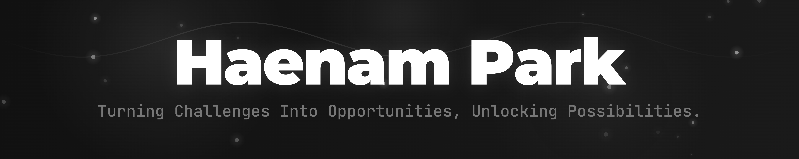
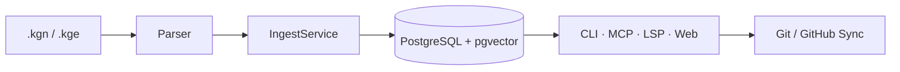

 

  
   
  <b>Actively seeking opportunities to grow and contribute!</b>

 

## 🐣 About Me

Born in the spring of 2000, right as the millennium began.
Maybe that's why I'm always thinking about *what comes next.*

I'm currently preparing for my career. And strangely enough, this might be the most exciting time of my life. Ideas that used to float around vaguely in my head are finally taking shape, one by one, with a little help from AI.

Complex syntax, unfamiliar architectures, difficult engineering concepts... I'm learning firsthand that these are all just tools for bringing ideas into the world.

There are a lot of similar things out there. Slightly different angles on something you've seen before. That's not necessarily a bad thing, but sometimes it feels like a ceiling. So every now and then, I ask myself:

> *"Could people 100 years ago have even imagined a smartphone?"*

Computers, the internet, AI... all of these were once *absurd ideas.* We're here today because someone held on to those ideas and refused to let go. I want to be that kind of person.

New ideas, collaboration, or just an interesting conversation — I'm always open. 😄

 

---

## 🧐 What I Build By

### `Backend Architecture`

I'm drawn to designing the structural foundation of a service. Not just code that works — but code where roles and responsibilities are clearly separated. When I define boundaries between domains and ensure consistency in API design, I'm always asking: *"How does this technical decision affect scalability and stability?"*

### `AI-driven Services`

Through consistent use of AI services like ChatGPT and Gemini, I've developed a deep interest in what real value AI can deliver to users. I also look at the other side — hallucination, privacy risks, cost structures, and other business-level constraints. I want to build services that maximize user-perceived value while honestly reflecting the limitations of the technology in their design.

### `Product Thinking`

I have a habit of asking *"Why is this feature needed?"* before anything else. Rather than jumping straight into code when given requirements, I try to understand the user context and business purpose behind them. Technology is the means, not the end — I believe a product only becomes good when it delivers tangible value to its users.

 

---

## 📌 Featured Project

### [KGN — Knowledge Graph Node](https://github.com/baobab00/kgn)

A CLI + MCP server that gives AI agents **persistent, queryable memory** — backed by PostgreSQL and pgvector.

- Custom `.kgn`/`.kge` file format parser for structured knowledge nodes and edges
- PostgreSQL + pgvector storage with semantic similarity search
- MCP server that plugs directly into Claude and other AI agents
- LSP server + VS Code extension for IDE-level editing support
- Multi-agent task orchestration with conflict detection and lease management
- GitHub sync for version-controlled knowledge export

`Python` `PostgreSQL` `pgvector` `FastMCP` `LSP` `Typer` `Pydantic` `GitHub Actions`

Architecture — 16 Mermaid diagrams inside  →  <a href="https://github.com/baobab00/kgn/blob/master/ARCHITECTURE.md">Deep Dive</a>

 

 

---

## ✨ Live Services

| Service | Description |
|---|---|
| **[MeNode](https://menode.app)** | Structures records with @node and #date tags, explores context through relationship visualization |
| **[YT Insights](https://ytinsights.dev)** | Analyzes YouTube Most Replayed heatmaps to quantify viewer behavior patterns |
| **[Pokuzzle](https://www.pokuzzle.com)** | A strategy puzzle web game — form poker hands from adjacent tiles on an 8x8 grid |

 

---

## 👽 Open Source

| Project | Description |
|---|---|
| [lecture-summarizer](https://github.com/baobab00/lecture-summarizer) | Lecture summarization tool |
| [chatgpt-blur-extension](https://github.com/baobab00/chatgpt-blur-extension) | Browser extension for blurring ChatGPT conversations · [Chrome Web Store](https://chromewebstore.google.com/detail/chatgpt-blur/ghageddlnooippamdabmohhaaccimkfo) |
| [yt-heatmap](https://github.com/baobab00/yt-heatmap) | YouTube heatmap visualization tool |

 

---

## 🛠️ Tech Stack

**Languages**

**Backend**

**Frontend**

**Database**

**Infra & DevOps**

 

---

## 🐾 Stats

&nbsp;

 

---

